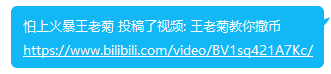

<div align="center">
  <a href="https://v2.nonebot.dev/store"></a>
  <br>
  <p></p>
</div>

<div align="center">

# nonebot-plugin-bilibili-notifier

_✨ B站UP的更新与开播通知机 ✨_


<a href="./LICENSE">
    
</a>
<a href="https://pypi.python.org/pypi/nonebot-plugin-bilibili-notifier">
    
</a>


</div>

## 📖 介绍

B站UP的更新与开播通知机，默认每分钟爬取一次B站账号的动态与直播列表，将设置好的特定UP的更新或开播信息推送到QQ群里。

## 💿 安装

<details open>
<summary>使用 nb-cli 安装</summary>
在 nonebot2 项目的根目录下打开命令行, 输入以下指令即可安装

    nb plugin install nonebot-plugin-bilibili-notifier

</details>

<details>
<summary>使用包管理器安装</summary>
在 nonebot2 项目的插件目录下, 打开命令行, 根据你使用的包管理器, 输入相应的安装命令

<details>
<summary>pip</summary>

    pip install nonebot-plugin-bilibili-notifier
</details>
<details>
<summary>pdm</summary>

    pdm add nonebot-plugin-bilibili-notifier
</details>
<details>
<summary>poetry</summary>

    poetry add nonebot-plugin-bilibili-notifier
</details>
<details>
<summary>conda</summary>

    conda install nonebot-plugin-bilibili-notifier
</details>

打开 nonebot2 项目根目录下的 `pyproject.toml` 文件, 在 `[tool.nonebot]` 部分追加写入

    plugins = ["nonebot_plugin_bilibili_notifier"]

</details>

## ⚙️ 配置

首先用你的B站账号关注这些你想要追踪的UP主。

然后导出B站cookies，建议使用Firefox的Export cookie JSON file for Puppeteer插件直接生成JSON文件，如果想手动生成，请确保以下字段有效：
```
{
  "sessdata": "",
  "bili_jct": "",
  "buvid3": "",
  "dedeuserid": "" 
}
```
建议导出cookies时使用和常用的浏览器不同的浏览器（或匿名模式），不然B站会定时要求刷新你的cookies。

在 nonebot2 项目的`.env`文件中添加下表中的必填配置

| 配置项 | 必填 | 默认值 | 说明 |
|:-----:|:----:|:----:|:----:|
| bnotifier_cookies | 是 | 无 | 上面导出的B站cookies的文件路径 |
| bnotifier_push_updates | 否 | {} | 设置追踪更新的UP主的ID（点击主页后地址中显示的space.bilibili.com/\[这个号码\]）以及要推送的QQ群号，格式为{UP1: \[QQ群1， QQ群2, ...\], ...}。注意全部号码都应为字符串，一个例子：`{"823532": ["xxxxx", "yyyyy"]}`|
| bnotifier_push_updates_by_group | 否 | {} | 作用同bnotifier_push_updates但格式为{QQ群: \[UP1, UP2, \]}，选择一个更适合你的方式即可 |
| bnotifier_push_lives | 否 | {} | 同bnotifier_push_updates但这个变量控制的是开播通知 |
| bnotifier_push_lives_by_group | 否 | {} | 格式同bnotifier_push_updates_by_group但这个变量控制的是开播通知 |

其它配置为开发调试时使用，正常使用无需调整。

### 效果图

